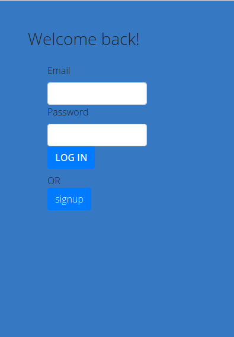
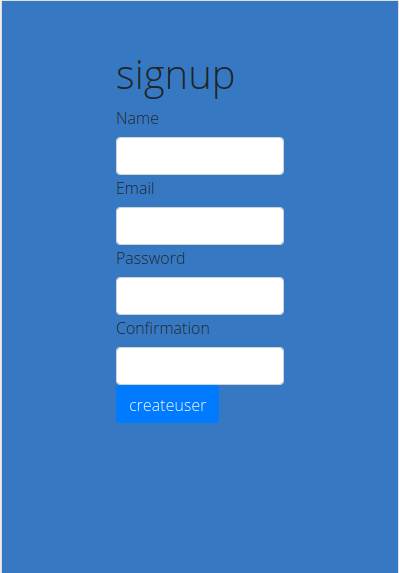
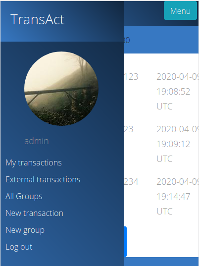
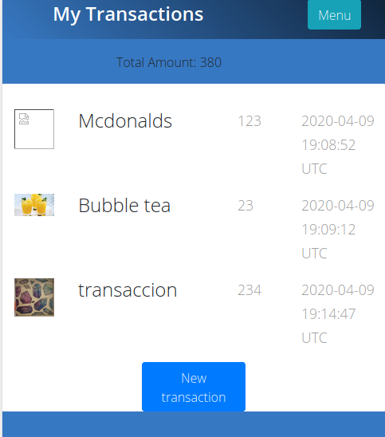
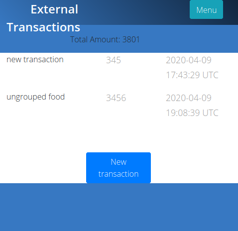
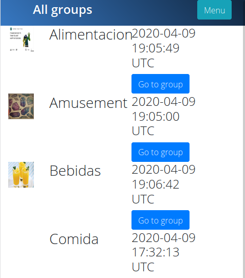
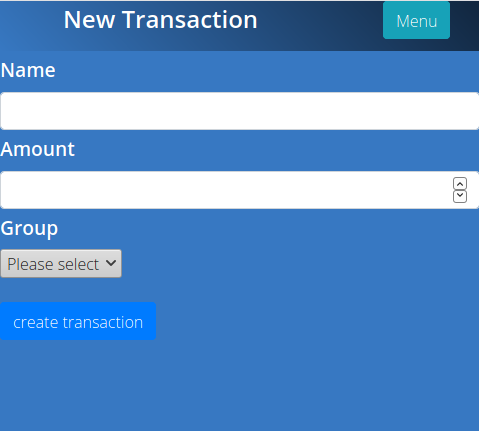
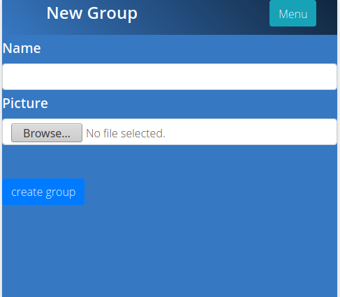

<br />
<p align="center">
  <a href="https://github.com/Usagib/ror_capstone">
    
  </a>

  <h3 align="center">Transaction App - RoR Capstone Project </h3>

  <p align="center">
    The following project serves as assessment for Ruby on Rails as a Microverse Student
    <br />
    <a href="https://www.notion.so/Group-our-transactions-ccea2b6642664540a70de9f30bdff4ce"><strong> Project Specs »</strong></a>
    <br />
    <br />
  </p>
</p>

> Assessment on Ruby on Rails

<!-- TABLE OF CONTENTS -->
## Table of Contents

* [About the Project](#about-the-project)
* [Live Demo](#live-demo)
* [How to run](#how-to-run)
* [Features](#features)
* [Screenshots](#screenshots)
* [Testing](#testing)
* [Built With](#built-with)
* [Contact](#contact)

## About The Project

A Ruby on Rails mobile app wich allows user to signup,login, create transactions and group them  

## Live Demo

* [TransAct App](https://trans-act-app.herokuapp.com/)

### How to run


 - Prerequisites

Ruby: 2.6.5
Rails: 5.2.4.2
Postgres: >=9.5


Instal gems with:

```
bundle install
```

Setup database with:

```
   rails db:create
   rails db:migrate
```

Start server with:

```
    rails server
```

Open `http://localhost:3000/` in your browser.

### Features

* Users can log into the app
* New Users can create an account
* Logged users can create new groups
* Logged users can create new transactions and add them to existing or no group
* logged users can see a list of their grouped transactions
* logged users can see a list of their ungrouped transactions
* logged users can see al groups created
* Sidebar menu serves as User profile showing logged user name and example picture
* Friendly UI lets user logically access this features

### Screenshots
Login
 
Signup
 
Menu
 
My transactions
 
External transactions
 
Groups
 
New transaction
 
New group
 


## Built With
Project built in Ruby on Rails
* [Ruby](https://www.ruby-lang.org/en/)
* [Rails](https://rubyonrails.org/)

Additional Gems used
* Bootstrap v4.0
* [DatabaseCleaner](https://github.com/DatabaseCleaner/database_cleaner)
* [Shoulda Matchers](https://github.com/thoughtbot/shoulda-matchers)
* [Capybara](https://github.com/teamcapybara/capybara)
* [MiniMagick](https://github.com/minimagick/minimagick)
* [CarrierWave](https://github.com/carrierwaveuploader/carrierwave)
* [Bcrypt](https://rubygems.org/gems/bcrypt/versions/3.1.11?locale=es)


### Testing

```
    rpsec
```
* Rspec model testing done for validation and associations
* Rspec - Capybara testing for features


## Contact

Eduardo Bonilla [https://github.com/UsagiB](https://github.com/UsagiB)


## Show your support

Give a ⭐️ if you like this project!
